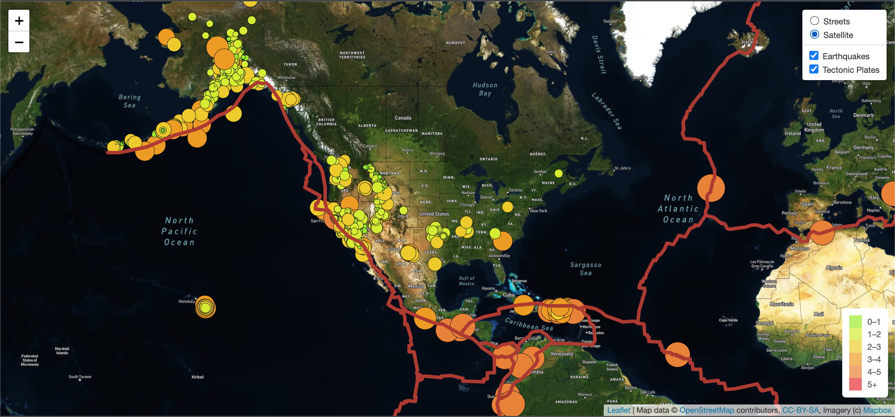
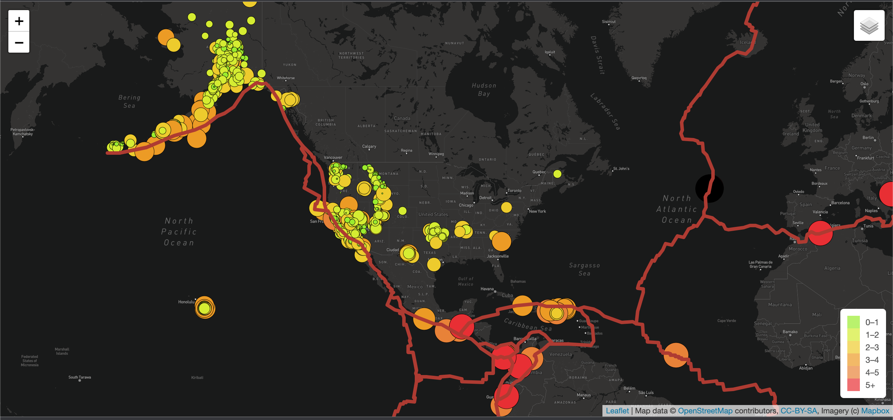

# Mapping_Earthquakes

## Purpose
The purpose of this challenge is to see the earthquake data in relation to the tectonic plates' location on the earth. In addition, I was tasked with seeing all the earthquakes with a magnitude greater than 4.5 on the map, and seeing all the data on a third map.

## Results
### Deliverable 1
For Deliverable 1, I was tasked with adding the tectonic plate data using d3.json(), add the data using the geoJSON layer, set the tectonic plate LineString data to stadn out on the map, and add the plate data to the overlay object with the earthquake data.

### Deliverable 2
In Deliverable 2, I added the major earthquake data, added color, and set the raduis of the circle markers based on the magnitude of the earthquake. I also added a popup marker for each earthquake that displays the magnitude and location of the earthquake using the GeoJSON layer.
![Major_Earthquakes(./Earthquake_Challenge/Major_Earthquakes.png)

### Deliverable 3
For the last Deliverable, I was requested to simply add a third style to the earthquake map. I used the Dark Map as shown below.

## Resources
- Javascript

- VS Code

- mapbox.com

- openstreetmap.org

- earthquake.usgs.gov

- raw.githubusercontent.com/fraxen/tectonicplates/master/GeoJSON/PB2002_boundaries.json

